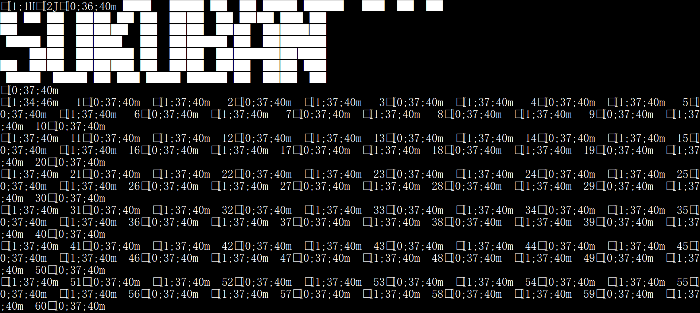

<div align="center">
    <h1>SokobanMASM32</h1>
    <p><em>Sokoban written in x86 assembly</em></p>
    
</div>

## Compile

1. Install [MASM32 SDK](https://www.masm32.com/) to `C:\masm32`.
2. Add `C:\masm32\bin` (the directory containing `ml.exe`) to `PATH`.
3. Run

```sh
ml /coff sokoban.asm /link /subsystem:console
```

**NOTE**: If you decide to install MASM32 SDK to a directory other than `C:\masm32`, change the `includelib` statements in `sokoban.asm` (lines 5-6) accordingly before compiling.

## Run

Run `sokoban.exe` in a terminal supporting ANSI escape sequences such as [Windows Terminal](https://aka.ms/terminal), [Fluent Terminal](https://apps.microsoft.com/store/detail/fluent-terminal/9P2KRLMFXF9T), [ConEmu](https://conemu.github.io/), or the built-in terminal of [Visual Studio Code](https://code.visualstudio.com/). **Do not double-click `sokoban.exe` directly**, or you will see a complete mess:



## License

SokobanMASM32 is licensed under the [MIT license](https://opensource.org/licenses/MIT).
