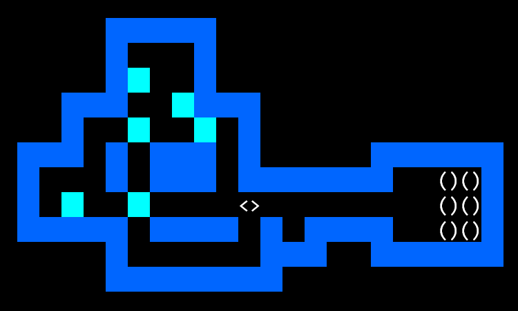

<div align="center">
    <h1>x86sokoban</h1>
    <p><em><a href="https://en.wikipedia.org/wiki/Sokoban">Sokoban</a> written in x86 assembly</em></p>
    
</div>

## Compile

1. Install [MASM32 SDK](https://www.masm32.com/) to `C:\masm32`.
2. Add `C:\masm32\bin` (the directory containing `ml.exe` and `link.exe`) to `PATH`.
3. Run

```sh
ml /c /coff sokoban.asm
link /SUBSYSTEM:console /LIBPATH:"C:\masm32\lib" sokoban.obj
```

Alternatively, use GNU make:

```sh
make LIBPATH=C:\masm32\lib
```

## Run

Run `sokoban.exe` in a terminal supporting ANSI escape sequences (such as [Windows Terminal](https://aka.ms/terminal), [Fluent Terminal](https://apps.microsoft.com/store/detail/fluent-terminal/9P2KRLMFXF9T), [ConEmu](https://conemu.github.io/), and the built-in terminal of [Visual Studio Code](https://code.visualstudio.com/)). `conhost.exe` is NOT supported.

## License

SokobanMASM32 is licensed under the [MIT license](https://opensource.org/licenses/MIT).
